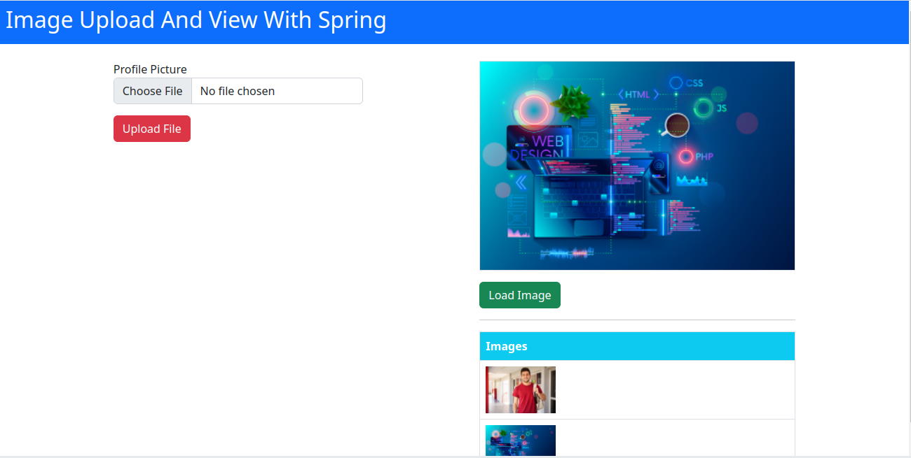

<h1>Image Uploading</h1>
<h3>Spring MVC & HTML</h3>

This example is to demonstrate, how to upload image files using <b>Spring MVC</b> and <b>HTML</b> with <b>AJAX</b>

Clone the project, and open both <b>FrontEnd</b> and <b>BackEnd</b> using <b>IntelliJIDEA.</b>

### LICENSE

Copyright © 2022 Sanu Vithanage. All rights reserved. Licensed under the [MIT LICENSE](LICENSE).

<b>Hope you will find this useful oneday..!</b> :wink:

